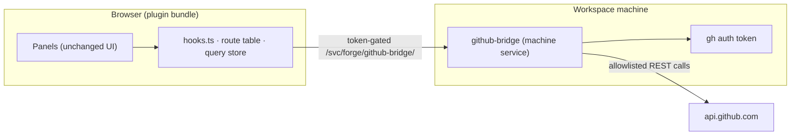

# Forge — PRs & Issues plugin for Soft-Machine

Browse, triage, and act on GitHub pull requests and issues from inside a
Soft-Machine workspace: live-synced list panels, detail panels with
diffs/checks/comments, composers for new issues and PRs, and full-context
handoff to the workspace agent.

The plugin uses the **workspace's own GitHub connection** — whatever `gh` is
signed in with on the workspace machine (the Soft-Machine GitHub App
installation, or a `GH_TOKEN` connected under Settings → Integrations). It
runs on the current Soft-Machine host with no server-side proxy and no
special SDK generation.

## How it works



- **Panels** are the same components as before; they ask for data by
  resource path (`/issues?repo=…`, `/comments?…`) and post writes to
  actions (`/comment`, `/merge`). That vocabulary is now a typed route
  table in `bindings/web/github/routes.ts`.
- **The route table** maps each resource to GitHub REST/Search calls and
  normalizes the responses (`github/normalize.ts`) into the panel types.
  Lists use the Search API (exact totals, comment counts on PR rows, free
  text plus qualifiers); everything else is plain REST.
- **The query store** (`bindings/web/query/`) caches by resource path,
  dedupes co-mounted panels, polls only while visible, backs off on errors,
  and refreshes in place after writes so panels never blank.
- **The bridge** (`bindings/vm/github-bridge.js`) is a dependency-free Node
  HTTP service declared under `machine.services` in the manifest. The host
  starts it on demand and gives the browser a token-gated URL through
  `usePluginService`. It reads the GitHub credential from `gh auth token`,
  proxies an explicit allowlist of GitHub routes, reports which kind of
  credential is present (`/whoami`), and lists git origins under
  `/workspace` for repository auto-detection (`/local/repos`).

### Security model

- No GitHub credential ever reaches the browser. The bridge attaches it only
  to requests bound for `api.github.com`, and only for allowlisted
  method+path pairs (reads of issues/pulls/labels/branches/checks; creating
  issues, pulls, and comments; editing state and labels; merging). Nothing
  else — no deletes, no contents, no secrets.
- The host reaches the bridge through two proxies: the token-gated
  `/svc/…` route and the unauthenticated public port forward. The bridge
  therefore requires the `sc_` service token as `Authorization: Bearer` on
  every request and validates it by asking the workspace server on loopback
  to route a nonce back through the token gate. Forwarded headers are never
  trusted.
- The bridge binds to `127.0.0.1` only.

### Manifest and bridge parity

Published plugin artifacts carry the manifest and the built browser bundle
only, so the bridge source is inlined verbatim into the manifest's service
args. `bindings/vm/github-bridge.js` is the source of truth:

```bash
node scripts/sync-manifest.mjs          # rewrite the manifest's service args
node scripts/sync-manifest.mjs --check  # CI-style check
```

`__tests__/manifestParity.test.ts` fails if the two drift.

### Diagnostics

The bridge writes one access line per request (method, path, status,
latency — never tokens or query strings) to its stderr, which the host
captures as the service log, and to `bridge.log` in its per-service data
directory on the machine (`/workspace/.soft-machine/machine/data/forge/`).

## Install into a workspace

Run inside the workspace VM:

```bash
gh repo clone forloopcodes/soft-machine-plugin-forge /soft-machine/plugins/forge
```

The directory name **must** be `forge` — the plugin-service requires the
directory to match the manifest id. Then enable **PRs & Issues** in the
Plugins window (or ask the workspace agent to). The bridge starts on demand
and the four panels (Pull Requests, Issues, Pull Detail, Issue Detail) mount
within a few seconds.

Requirements on the workspace machine: `node` (18+) and `gh` signed in to
github.com — both are present in Soft-Machine workspaces, and the GitHub App
connection signs `gh` in automatically. With a GitHub App credential, the
panels see the repositories the installation covers and whatever
permissions it grants; connect a `GH_TOKEN` in Settings → Integrations for a
personal-token view instead.

## Updating

```bash
git -C /soft-machine/plugins/forge pull
```

The plugin-service versions the tree by newest file mtime, so every pull (or
edit) rebuilds and remounts the module on the next poll — no restarts. The
bridge process is (re)started when the plugin is enabled; after changing the
bridge, disable and re-enable the plugin to pick it up.

## Layout

```
soft-machine.plugin.json    cold manifest: id, label, panels, integrations,
                            machine service (inlined bridge), module entry
scripts/sync-manifest.mjs   copies the bridge source into the manifest
bindings/vm/
  github-bridge.js          the machine service (Node, no dependencies)
bindings/web/
  module.ts                 registration + default export
  meta.ts                   FORGE_META — must mirror the manifest exactly
  ForgeContext.tsx          provider: selection, filters, bridge client,
                            connection state
  ForgeToolbar.tsx          repo picker, refresh
  hooks.ts                  useForgeQuery / useForgeMutation / useOpenDetail /
                            useVmRepoAutoDetect / useSendToAgent
  github/bridge.ts          browser client for the bridge (token handling,
                            error classification)
  github/normalize.ts       GitHub REST → panel types
  github/routes.ts          resource paths → GitHub calls; actions → writes
  query/store.ts            shared cache + visibility-aware polling
  query/useQuery.ts         React binding (useSyncExternalStore)
  types.ts                  panel types + pure helpers
  agentContext.ts           context-block builders for agent handoff
  markdownNormalize.ts      GitHub-flavored markdown cleanup
  panels/                   the four panels + composers + shared pieces
  __tests__/                unit tests (see below)
```

Only `react`, `styled-components`, and `@soft-machine/sdk` may be imported
by the browser code — anything else will not resolve on the VM bundler.

## Tests

```bash
bun install
bun run test
```

The suite covers the framework-free layers: types and helpers, the GitHub
normalizers, the route table (against a recording fake of the bridge
client), the query store (fake timers), the browser bridge client, the VM
bridge's allowlist and repository scan, and manifest/bridge parity. Panel
rendering and the host hooks are exercised by the running workspace.

```bash
bun run smoke [owner/repo]
```

`scripts/smoke-bridge.mjs` is an end-to-end check that needs no browser: it
runs a fake token authority, spawns the bridge exactly as the host does, and
exercises the auth gate, `/whoami`, the repository scan, a refused route, and
a real GitHub read with the machine's `gh` credential.
