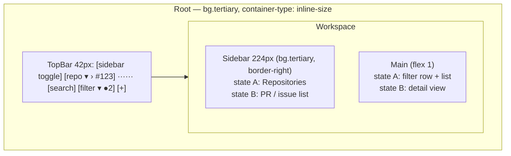
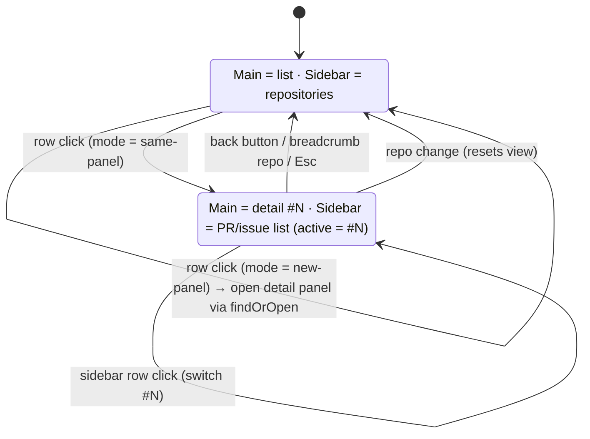

# bettergit — UI redesign plan

Scope: the four panels the plugin defines (`bettergit-pulls`, `bettergit-issues`,
`bettergit-pull-detail`, `bettergit-issue-detail`), the plugin toolbar, and the shared
styling layer under `bindings/web/panels/`. The data layer (bridge, routes,
query store, normalize) is out of scope except where the navigation model needs
a new hook.

Inputs: `/soft-machine/manual/.../reference/panel-design.md` (the authority),
`/workspace/sm-workspace-kanban` (the reference implementation to imitate), and
`/workspace/sm-workspace-calendar` (read for contrast; mostly a list of what
not to copy).

---

## 1. What makes the kanban/calendar UI read as clean

Both plugins share one visual grammar. Kanban implements it correctly; the
calendar copy-pastes it and drifts. These are the rules worth carrying over,
each verified against the manual.

1. **One shell for every panel.** `Root` (container-type inline-size, flex
   column, 100% × 100%, min-width 0, overflow hidden) → `TopBar` (42px,
   `bg.tertiary`, 1px bottom border, `padding: 0 12px`, two `ToolbarGroup`s
   with `gap: 4px`) → `Workspace` (flex row) → optional `Sidebar` (224px,
   `bg.tertiary`, right border) + `Main`.
2. **Sidebar is three regions**: a fixed section, a `flex: 1` scrolling
   section, and a `border-top` footer with identity. Headings are the SDK
   section-label recipe (xs / 500 / uppercase / 0.3px / muted, 22px tall).
   Rows are 26px, `gap: 8px`, `padding: 0 6px`, `t.radius`, hover to
   `bg.secondary`; **selection is the hover fill held**, never an accent bar.
3. **Row actions are `opacity: 0` and appear instantly** on `:hover` /
   `:focus-within`. No `display: none` (layout shift), no transition.
4. **Hover snaps, structure animates.** No `transition` on color/background/
   border hover. Transitions only for collapse (0.15s), chevron rotation
   (0.15s), progress (0.2s), modal entry (0.15s), all gated on
   `prefers-reduced-motion`. Keyframes are namespaced (`kanban-spin`).
5. **Accent is rationed** to one filled 24px `CreateButton` per panel, the
   spinner arc, and soft tints via `rgba(${t.accent.primaryRgb}, 0.06–0.18)`.
   Filled accent text is `t.accent.text`; hover darkens with
   `color-mix(in srgb, ${t.accent.primary} 82%, black)`.
6. **Focus is a border lift** (`color-mix(in srgb, ${t.border} 92%, white 8%)`),
   never an accent ring. Card hover brightens the border toward text
   (`color-mix(in srgb, ${t.text.muted} 35%, ${t.border})`), not the fill.
7. **Radius by role**: `t.radius` rows/buttons/chips, `× 1.25` cards,
   `× 1.5` composers/modals, `999px` pills, `50%` dots. One border recipe:
   `${t.borderWidth} solid ${t.border}`, only on contained objects; regions are
   separated by 12px spacing.
8. **Surface budget**: body `tertiary`, hover/selection `secondary`, inputs and
   floating `elevated`. Never `bg.primary` inside a panel.
9. **Typography by role only**: micro counts/timestamps, xs section labels
   and chips, sm hints, base item names, md titles (600). Weights 400/500/600.
   Mono (`t.fontMono` + `t.typographyMono.*`) for ids, hashes, branch names,
   counts, with `tabular-nums`.
10. **Icon sizes are a fixed set**: 11 inside chips, 12 in rows/menus/inline
    actions, 14 in the top bar, 16 for panel registration, 24–28 in empty and
    error states. SDK `Icon` only.
11. **All three states ship**: a centered `StateView` (muted icon at 0.5 or a
    ring+accent-arc `Spinner`, md/500 title, sm muted body, optional compact
    primary CTA), `role="status"` for loading, `role="alert"` for errors.
    Errors are inline banners on a 12% `status.error` wash with a bordered
    Retry — never a bare red string.
12. **Container queries, not viewport**: `@container (max-width: 520px)` stacks
    the top bar, `≤ 760px` hides the sidebar, `≤ 420px` drops optional selects
    (`display: contents` trick).
13. **Chips** are 18px: `Chip` (999px pill, tone tint
    `color-mix(tone 16%, transparent)`), `MetaChip` (`t.radius`, transparent,
    danger/warning/muted tones), `Count` (mono micro muted tabular).
14. **Settings** live in three tiers: host-rendered `settings.declarations`
    (read with `usePluginSettings`), shared object settings in the data model,
    and personal view state via `usePersistedState(..., { scope: "user" })` /
    `useGlobalPersistedState`. Never `localStorage`. Settings commit
    immediately; no Save button.
15. **Cross-panel navigation** is `useOpenPanelSafe` + `usePanelSignal`, with an
    explicit "Open in …" action in the detail footer.

**Do not copy** (from the calendar, and a few kanban slips): `window.prompt`,
`window` keydown shortcuts, `filter: brightness()` hovers, `font-size: 0`,
`border-left: 3px`, hand-rolled modals without focus trap, `ContextMenu`
without `onDismiss`, hover to the same surface the control sits on, three
solid-accent "today" markers at once, icon sizes 13/15, un-namespaced
`@keyframes spin`, `calc(${t.radius} - 1px)`, `font-weight: 700`, literal
`1px`/`2px` borders, inline `style={{}}` overrides, `z-index: 20` literals.

---

## 2. Audit of the current forge panels against those rules

The current panels imitate the Git panel and are already token-disciplined in
places, but they violate the manual in ~40 spots and are internally
inconsistent between the four panels. Grouped by rule:

**Motion / hover (rule 4)** — every control has `transition: background
ANIMATION.fast` (`shared.tsx` `ItemRow`, `RowActionButton`; `FilterBar.tsx`
`SearchRow`, `HeaderChip`, `StateTab`, `QualifierTrigger`; `Pager.tsx`
`PagerButton`; `detailShared.tsx` `QuietActionButton`, `CommentCapsule`;
`PullDetailPanel.tsx` `Tab`; `ForgeToolbar.tsx` both buttons). `RowActions`
uses `display: none → flex`, which reflows the title on hover. No
`prefers-reduced-motion` gate anywhere.

**Accent (rule 5)** — accent used as *text color* for selected options
(`FilterBar.tsx` `OptionRow`, `QualifierTrigger $active`; `RepoPicker.tsx`
`RepoRow`; `PullComposer.tsx` `BranchOption`; `IssueDetailPanel.tsx`
`LabelOption`), as a *focus ring* (`RepoPicker.tsx` `RepoSearchInput:focus`,
`PullComposer.tsx` `BranchSearch:focus`), and as a 2px tab underline
(`PullDetailPanel.tsx` `Tab`).

**Surfaces (rule 8)** — `t.bg.primary` painted inside the panel
(`RepoSearchInput`, `BranchSearch`). `FilterBar.tsx` `ChipCount` is
`bg.tertiary` inside a transparent chip on a `bg.tertiary` body (invisible).
`PullDetailPanel.tsx` uses four surfaces (`tertiary`, `secondary`, `elevated`
in `CheckRowLink:hover`, plus the composer).

**Borders / elevation (rule 7)** — `box-shadow: 0 0 0 1px` used as a border on
`AccentButton:disabled` and `MergeCaret`. `line-height: 15px` literals on
every chip. Mixed count-pill radii (`SectionCount` `t.radius` vs `TabCount`
`999px`).

**States (rule 11)** — `ErrorRow` / `InlineError` are bare red strings in
`t.ansi.red` (should be `t.status.error` on a 12% wash with Retry). Empty
states are top-aligned text with no icon and, for "Not connected", no action.
Loading is the string "Loading…" with no spinner.

**Typography / icons (rules 9, 10)** — icon sizes used: 9, 10, 11, 12, 13, 16.
`ForgeToolbar.tsx` `Badge` uses `typography.base` for a status hint. Detail
title is `typography.base` 400 (should be md/500 as the panel's one title).

**Structure / duplication** — three copies of the elevated composer capsule
(`IssueComposer`, `PullComposer`, `ReplyComposer` in `detailShared.tsx`); two
copies of the search input; `Section` hand-rolled where SDK `SectionLabel`
exists; `Avatar`/`AvatarFallback` hand-rolled where SDK `UserAvatar` exists.
`ForgeToolbar` shows a provider dropdown with exactly one option (GitHub) and a
text "Refresh" button styled unlike anything else. `#f59e0b` is repeated three
times instead of living in `STATE_COLORS`. Literal `padding: 0 12px 4px` in
`IssueDetailPanel.tsx` instead of `EDITOR_SPACING.containerPadding`. Manifest
`minWidth: 280/300` are legacy numerics (should be tiers).

**Consistency between the four panels** — list panels and detail panels use
different header treatments (filter toolbar vs bordered header block),
different action button styles (`IconButton` in the host header vs
`QuietActionButton` in-body), different chip radii, and the Pull detail has a
tab strip while the Issue detail has none. The two list panels are consistent
with each other; the two detail panels mostly are; the pairs are not.

---

## 3. Target design

### 3.1 Panel anatomy (both list panels, identical)

- **Root** paints `t.bg.tertiary` (these are tool panels, not canvases).
- **TopBar** left group: sidebar toggle (`PanelLeft`/`PanelLeftClose`, 14px),
  breadcrumb. The breadcrumb's repo segment is the existing `RepoPicker`
  dropdown re-skinned as a `PickerButton`; in detail view a `#123` segment and
  a leading back `IconButton` (`ArrowLeft`) appear. Right group: collapsible
  `SearchBox` (26px, elevated), one **Filter** `Dropdown` (sections Author /
  Label / Milestone / Assignee / Sort, an accent `Badge` with the active
  count, a "Clear" item), and the single accent **CreateButton** (24px, `Plus`)
  that toggles the inline composer.
- **Filter row** (list view only, 28px, below the TopBar): a `SegmentGroup`
  with `Open N` / `Closed N`, right-aligned `Count` of results and the
  pager (`Prev · Page N · Next` as `GhostButton`s).
- **Composer** (when open): the shared elevated capsule docked under the
  filter row — title input, body textarea, bottom toolbar with Cancel (ghost)
  and Create (`Button $variant="primary" $compact`). PR composer adds the
  base ⇄ compare `PickerButton`s and a `Toggle` for Draft (replacing the raw
  checkbox).
- **List rows**: two-line `ItemRow` (min-height 40px, `padding: 6px 12px`,
  `gap: 2px`): line 1 = state icon (12px, semantic color) + title (base,
  truncated) + `RowActions` (opacity-revealed: send-to-agent, open in new
  panel, open on GitHub); line 2 = `Count`-styled `#123`, author,
  relative time, comment count with `MessageSquare` 11px, then label
  `Chip`s (18px pills, tone tint from the label color). Active row = the
  hover fill held.
- **Sidebar footer**: `UserAvatar size={16}` + login (user mode) or "GitHub
  App · N repositories" (installation mode) or "Not connected" + hint.

### 3.2 Sidebar states and the same-panel navigation model

The sidebar always shows the *parent level* of what Main shows.

- **Setting `detailOpenMode`**: `"same-panel"` (default) or `"new-panel"`.
  User-scoped, global across panel instances. Exposed in a **Settings**
  `Dropdown` on the panel header (`Settings` gear, host `IconButton`) with two
  radio-style `DropdownItem`s ("Open details in this panel" / "Open details in
  a new panel") plus a "Show sidebar" toggle item.
- **Per-instance view state** `{ view: "list" | "detail", number }` via
  `usePersistedState("view", …, { scope: "user" })` inside the panel (auto
  panel scope), so two Pulls panels can look at different PRs and the view
  survives remounts. Repo stays global in `ForgeContext` (all four panels
  follow one repo, as today).
- `useOpenDetail(kind)` becomes mode-aware: same-panel → set the instance view;
  new-panel → today's `openPanel({ mode: "findOrOpen" })`. A row hover action
  and a detail header action "Open in new panel" always pop out regardless of
  mode (sets the global `selectedPull/Issue`, opens the detail panel).
- Sidebar state B rows are single-line 26px `SidebarRow`s: state icon 12px,
  `#123` `Count`, title truncated. Header is the section label
  "PULL REQUESTS" + `Count`, with the Open/Closed `SegmentGroup` under it and
  the pager at the bottom. Data = the same list query as Main (the query store
  dedupes, so this is free).
- Narrow panels: sidebar auto-hides at `@container (max-width: 600px)` (the
  panels default to 380px today, so the default width moves to 640). Repo
  switching stays available through the breadcrumb dropdown, and the detail
  view's back button returns to the list, so nothing is lost when hidden.

### 3.3 Detail view (shared by embedded and standalone)

One `PullDetailView({ repo, number, embedded })` and one `IssueDetailView`
render both inside the list panel (state B) and inside the standalone detail
panels, which become thin wrappers over the global selection.

- **Header block** (`padding: 8px 12px 10px`, bottom border): line 1 = state
  pill (bordered 999px, semantic text color, 11px icon) + `#N` `Count` +
  author + time + spacer + `RowActions`-style icon cluster (open on GitHub,
  open in new panel when embedded); line 2 = title (md / 500, wraps); line 3
  (PR) = "wants to merge N commits into `base` from `head`" with mono
  `RefChip`s and the diffstat meter; line 4 = label `Chip`s, assignee and
  milestone `MetaChip`s.
- **Actions row**: `GhostButton`s only — Send to agent, Labels (issue),
  Close / Reopen. Merge stays the single primary action inside the merge box.
- **Tabs** (PR only): `SegmentGroup` Conversation / Files / Reviews with
  `Count`s, collapsing to icon+count under `@container (max-width: 340px)`.
  Replaces the accent underline tabs.
- **Conversation**: opening-post capsule + timeline events + comment capsules
  (`× 1.25` radius, `tertiary` header / `secondary` body, border-brighten on
  hover, `UserAvatar size={16}`, `Author`/`Bot` `MetaChip`s) → merge status
  box (bordered card; footer holds the primary Merge `Button` and a bordered
  `IconButton` caret for the method menu, no shadow rings) → reply composer
  (the shared capsule).
- **Files**: `FileDiffList` capsules kept; hover and chevron follow rules 4/6;
  status letters use `STATE_COLORS` including the new `pending`/`modified`
  entry.
- **Reviews**: 26px rows: verdict `MetaChip` (tone from state) + author +
  time.

### 3.4 States

- `LoadingState` (spinner, "Loading pull requests…") centered in Main.
- `ErrorBanner` at the top of Main: `AlertCircle` 14px, message, bordered
  **Retry** → `refresh()`; write errors reuse it inline at composer/actions.
- Empty list: `StateView` with `GitPullRequest`/`CircleDot` 24px at 0.5,
  "No open pull requests", hint with the repo name, CTA "New pull request"
  when the composer is closed.
- Not connected: `StateView` with `GitBranch` icon, "GitHub is not connected",
  hint pointing at Settings → Integrations, **Retry** button.
- No repository: `StateView` with `Folder` icon and a **Select repository**
  primary compact `Button` opening the picker; the sidebar (when visible)
  already lists workspace repos so this is rarely seen.

---

## 4. Implementation plan

Work happens in `/soft-machine/plugins/bettergit` (`/workspace/bettergit`), on a
branch `redesign/panel-ui`. Commits and the PR are authored as
`forloopcodes <meetnp1706@gmail.com>` with no co-author trailers and no
mention of tooling, per the workspace rule.

### Phase 0 — Verify SDK surface and add the design layer (no visible change)

1. Build the export probe (see memory `sdk-export-probe`) referencing:
   `SectionLabel`, `ListRow`, `Toggle`, `Select`, `Tooltip`, `UserAvatar`,
   `Checkbox`, `useFocusTrap`, `usePersistedState`, `useGlobalPersistedState`,
   `usePluginSettings`, `HeaderTabStrip`, `Z_INDEX`. Record which exist.
   Decision rule: if `usePluginSettings` exists **and** exposes a setter, back
   `detailOpenMode` with `settings.declarations` (kanban precedent, host
   settings page for free); otherwise use
   `useGlobalPersistedState("bettergit/settings", …, { scope: "user" })`. Either
   way the in-panel gear menu is the user-facing control.
2. Create `bindings/web/ui/` (the forge equivalent of kanban's
   `src/ui/shared.tsx`, written against the manual, not copied):
   - `shell.tsx`: `Root`, `TopBar`, `ToolbarGroup`, `Workspace`, `Main`,
     `Sidebar`, `SidebarSection`, `SidebarGrow`, `SidebarFooter`,
     `SidebarHeading` (or SDK `SectionLabel` if exported), `FilterRow`.
   - `controls.tsx`: `CreateButton`, `GhostButton`, `BareButton`,
     `PickerButton`, `SegmentGroup`/`Segment`, `SearchBox`/`SearchInput`,
     `Badge`.
   - `rows.tsx`: `rowStyles`, `SidebarRow`, `ItemRow`, `RowActions`, `Count`,
     `Chip`, `MetaChip`, `RefChip`, `StatePill`.
   - `states.tsx`: `StateView`, `Spinner` (`forge-spin` keyframe),
     `LoadingState`, `ErrorBanner`, `EmptyState`.
   - `composer.tsx`: the one elevated capsule (`Composer`, `ComposerInput`,
     `ComposerTextarea`, `ComposerToolbar`) used by issue, PR and reply
     composers.
   - `colors.ts`: `STATE_COLORS` moved here with `pending: "#f59e0b"` added;
     helper `toneFromHex()` for label chips.
3. Add `docs/design-checklist.md` = the manual checklist plus the forge
   specifics (icon sizes, surface budget, motion gate) for PR review.

### Phase 1 — Settings and navigation model

4. `ForgeContext.tsx`: add `settings: { detailOpenMode, sidebarOpen }` +
   setters (source chosen in step 1). Keep `repo`, `selectedIssue`,
   `selectedPull`, filters, composers as they are.
5. New `hooks.ts` additions:
   - `usePanelView(kind)` → `{ view, number, openDetail(n), back() }` on
     `usePersistedState("view", { view: "list", number: null }, { scope: "user" })`;
     resets to list when `repo` changes (effect keyed on repo).
   - `useOpenDetail(kind)` reads `detailOpenMode` and dispatches to
     `usePanelView` or the existing `findOrOpen`.
   - `useOpenDetailPanel(kind)` — the explicit pop-out used by "Open in new
     panel" actions.
6. Extract `PullDetailView` / `IssueDetailView` from the two detail panels
   into `panels/detail/`; the panel components become
   `<View repo={repo} number={selectedPull} embedded={false} />` with the
   not-selected state.
7. Tests (`__tests__/panelView.test.ts`, `settings.test.ts`): view reducer
   transitions from the state diagram, repo-change reset, settings
   sanitization of persisted blobs (unknown mode → default).

### Phase 2 — List panels

8. `panels/ListPanel.tsx` — one generic component parameterized by
   `kind: "pull" | "issue"`; `PullsPanel`/`IssuesPanel` become one-liners.
   Structure per §3.1: TopBar → FilterRow → Composer? → Main (list |
   detail) with Sidebar (repos | list).
9. `panels/sidebar/RepoSidebar.tsx` — sections "In this workspace" (bridge
   `/local/repos`, `Folder` icon) and "GitHub" (preview 8, search filters
   both, "Open owner/name" row for typed repos), footer identity from
   `whoami`. Reuses `filterRepos.ts`. `RepoPicker` stays as the breadcrumb
   dropdown and shares the same list builder.
10. `panels/sidebar/ListSidebar.tsx` — state B (§3.2).
11. `panels/TopBar.tsx` — breadcrumb, search, `FilterMenu` (replaces
    `FilterBar.tsx` qualifiers; Labels/Milestones browse chips removed as
    redundant), `CreateButton`. Active filter count badge.
12. `panels/ItemList.tsx` — rows per §3.1 using `rows.tsx`; keyboard
    Enter/Space kept; `aria-current` on the active row.
13. Composers rebuilt on `ui/composer.tsx`; Draft becomes an SDK `Toggle`.
14. Header actions (`headerActions`) reduced to Settings gear `Dropdown` +
    Refresh. Remove `ForgeToolbar.tsx`; `toolbar: { component: () => null }`.

### Phase 3 — Detail views

15. Restyle `PullDetailView`/`IssueDetailView` per §3.3 using `ui/`:
    header block, `GhostButton` actions, `SegmentGroup` tabs, capsules,
    merge box (border instead of shadow ring, caret as bordered `IconButton`),
    reply composer from `ui/composer.tsx`, `UserAvatar` for avatars, `Count`
    for numerals, `MetaChip` for role/verdict badges.
16. `FileDiffList.tsx`: remove transitions, gate chevron rotation, colors
    from `colors.ts`, `t.typographyMono.micro` for the mono sizes.
17. Detail empty/error/loading via `states.tsx`; standalone detail panels get
    a "Show list" hint that opens the matching list panel via `findOrOpen`.

### Phase 4 — Polish, verification, release

18. Sweep: no `transition` on hover properties; every remaining transition
    gated on `prefers-reduced-motion`; icon sizes ∈ {11, 12, 14, 16, 24};
    no `bg.primary`; no `box-shadow` inside panels; no `line-height: Npx`
    on chips; `EDITOR_SPACING.containerPadding` at every outer edge;
    truncation triad + `min-width: 0` on every flex ancestor (grep audit).
19. Manifest / `module.ts`: `layout: { width: 640, minWidth: "large" }` for
    the list panels, `{ width: 480, minWidth: "large" }` for details;
    add `description` to each panel; keep `sync-manifest` parity test green.
20. Visual verification on this workspace: `enable_plugin` (bundleError must
    be empty), `module_open` for all four, check default, a light theme, and
    Pixel (radius 0) — chips, pills, focus lift, and the sidebar collapse are
    where mistakes surface. Check at 380px, 640px and 1000px panel widths.
21. `bun run test`, `bun run check-manifest`, `bun run smoke`.
22. README: replace panel descriptions and screenshots; document the setting.
    Bump `package.json` to 3.0.0. Open the PR to `main`.

---

## 5. File change map

| File | Action |
|---|---|
| `bindings/web/ui/{shell,controls,rows,states,composer}.tsx`, `ui/colors.ts` | new |
| `bindings/web/panels/ListPanel.tsx`, `TopBar.tsx`, `ItemList.tsx`, `FilterMenu.tsx` | new (replace `FilterBar.tsx`, list parts of `shared.tsx`) |
| `bindings/web/panels/sidebar/RepoSidebar.tsx`, `ListSidebar.tsx` | new |
| `bindings/web/panels/detail/PullDetailView.tsx`, `IssueDetailView.tsx`, `detailShared.tsx` | extracted + restyled |
| `bindings/web/panels/PullsPanel.tsx`, `IssuesPanel.tsx` | shrink to `ListPanel` wrappers + header actions |
| `bindings/web/panels/PullDetailPanel.tsx`, `IssueDetailPanel.tsx` | shrink to view wrappers |
| `bindings/web/panels/IssueComposer.tsx`, `PullComposer.tsx`, `Pager.tsx`, `RepoPicker.tsx`, `FileDiffList.tsx` | restyle on `ui/` |
| `bindings/web/panels/shared.tsx` | delete after migration |
| `bindings/web/ForgeToolbar.tsx` | delete |
| `bindings/web/ForgeContext.tsx`, `hooks.ts` | settings + view-state hooks |
| `bindings/web/module.ts`, `soft-machine.plugin.json` | layout tiers, descriptions, toolbar null, settings declarations (if step 1 says so) |
| `bindings/web/__tests__/panelView.test.ts`, `settings.test.ts` | new |
| `README.md`, `docs/design-checklist.md`, `package.json` | docs, version |

---

## 6. Decisions taken (flip any of these before Phase 1)

- **Default `detailOpenMode` = same-panel.** It makes a single panel
  self-sufficient; users who like the old two-panel flow switch once.
- **Repo selection stays global** across all four panels (unchanged); only
  the list/detail view is per instance.
- **Sidebar shows the parent level** of Main (repos while listing, the list
  while viewing a detail) rather than always showing repos. This is the
  reading of "the sidebar state will change to the PR's details, like the
  list of PRs".
- **Composers stay inline** (elevated capsule under the top bar) rather than
  becoming modals; it matches the Git panel's commit composer and avoids a
  modal stack.
- **One Filter dropdown** replaces five qualifier dropdowns and the
  Labels/Milestones browse chips.
- **Sidebar hides below 600px container width** with no overlay drawer; the
  breadcrumb dropdown and back button cover the same actions.
- **`ForgeToolbar` is removed**; the provider dropdown had one option.
